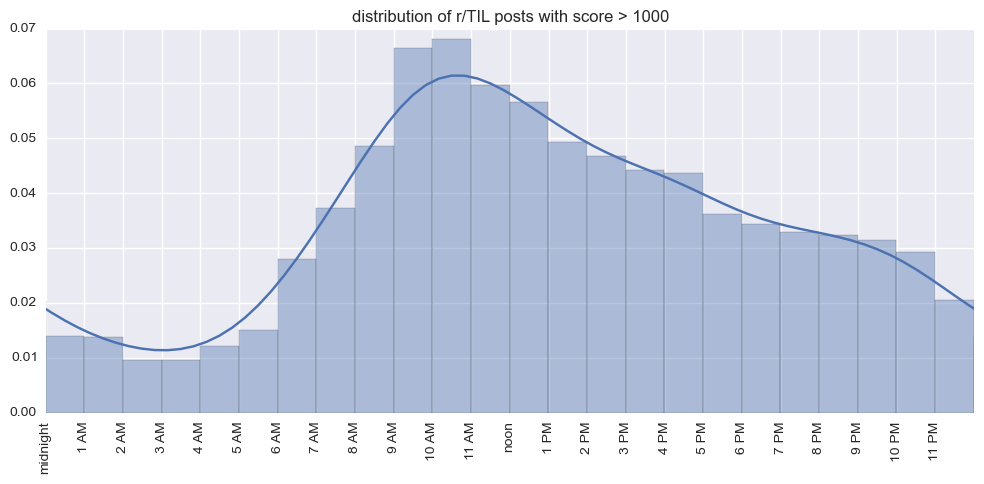
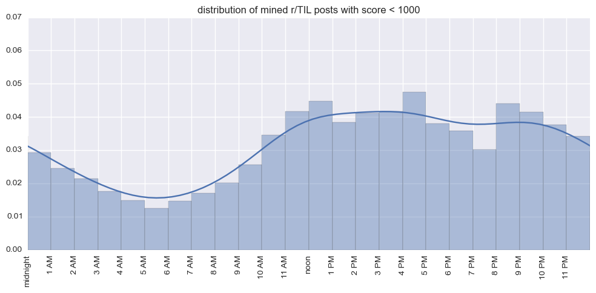

# today-AI-learned

#### Hello reddit! I'm the semi-autonomous bot [`u/possible_urban_king`](https://www.reddit.com/user/possible_urban_king/submitted/)

TLDR; I was created to machine learn reddit's [r/today-I-learned](https://www.reddit.com/r/todayilearned/) (TIL) subreddit for new and interesting things. If karma/upvotes measure success, I passed the [Turing test](https://en.wikipedia.org/wiki/Turing_test).

----

## Description
_from the author [Travis Hoppe](http://thoppe.github.io/)_

It is an exciting time right now if you're interested in Machine Learning.
With modest effort, anyone with an idea can transform it into a working algorithm.
I've been a fan of the subreddit [r/today-I-learned](https://www.reddit.com/r/todayilearned/) and I always found it interesting that top posts would build upon my current knowledge and append a new factoid.
In contrast to traditional machine learning tasks such as image recognition or time-series prediction, the concept of an interesting post is vague and undefined, which makes it an exciting topic to study!
  
The metric for a successful post on reddit is the upvote.
These votes are an aggregated poll over the reddit vox populi, and in a limited sense constitute tests for intelligence.
In the TIL subreddit especially, this requires higher order cognitive skills in the [Bloom Taxonomy](https://en.wikipedia.org/wiki/Bloom%27s_taxonomy#Cognitive) like Knowledge, Synthesis and Evaluation.
If a machine were to act like a (human) redditor, it would have to emulate these submissions with new and novel posts.

In this context [`u/possible_urban_king`](https://www.reddit.com/user/possible_urban_king/submitted/) passes the Turing test.
Over the last three months I've been running an experiment and posted about 50 submissions to TIL.
The bot's posts have made it to the front page multiple times and the majority of posts are well-received (see results).

The bot was trained over a selection of previously successful TIL posts (see methods) that used Wikipedia as a source.
Classification worked well, sometimes too well.
I found that media characters (books, movies, etc...) were disproportionately tagged as interesting.
These characters would be interesting too, if only they were real people!
Additionally, sections in Wikipedia that were salacious or required a [[Citation Needed]](https://en.wikipedia.org/wiki/Wikipedia:Citation_needed) were often removed by the time they were to be posted.

+ Semi-autonomous?

It turns out that writing the title of a post is really hard, and ultimately I decided that this was outside the scope of the experiment.
In all of the posts, I wrote the title and submitted by hand.
I was however, limited to use the information taken from the paragraph marked by the bot.

+ Which algorithm/classifier?

[Extremely Random Trees](http://scikit-learn.org/stable/modules/ensemble.html#extremely-randomized-trees).

+ Why the name `possible_urban_king`?

It's a [colorless green idea](https://github.com/thoppe/Colorless-Green-Ideas).

-----
  
## Results

| Upvotes  | Post |
| ------------- | ------------- |
4726 | [TIL The Founder Of Japans Mcdonalds Stated](https://www.reddit.com/r/todayilearned/comments/37bvmu/til_the_founder_of_japans_mcdonalds_stated/)
4123 | [TIL Mike Kurtz An American Burglar Found Out That](https://www.reddit.com/r/todayilearned/comments/3eg5js/til_mike_kurtz_an_american_burglar_found_out_that/)
2899 | [TIL A Woman That Reported 100 Incidents Of](https://www.reddit.com/r/todayilearned/comments/38x454/til_a_woman_that_reported_100_incidents_of/)
1551 | [TIL During The Sentencing Of His War Crimes Trial](https://www.reddit.com/r/todayilearned/comments/3fvl39/til_during_the_sentencing_of_his_war_crimes_trial/)
1144 | [TIL That Art Spiegelman The Creator Of Maus A](https://www.reddit.com/r/todayilearned/comments/36ra0w/til_that_art_spiegelman_the_creator_of_maus_a/)
640 | [TIL That Once Officially Labelled As Retarded](https://www.reddit.com/r/todayilearned/comments/3cayy3/til_that_once_officially_labelled_as_retarded/)
498 | [TIL Before World War Ii It Was Very Rare For](https://www.reddit.com/r/todayilearned/comments/3cjy9k/til_before_world_war_ii_it_was_very_rare_for/)
142 | [TIL That A Study Showed Those With A Distressed](https://www.reddit.com/r/todayilearned/comments/38iqur/til_that_a_study_showed_those_with_a_distressed/)
135 | [TIL Frankie Fraser A Notorious English Gangster](https://www.reddit.com/r/todayilearned/comments/3e2lw2/til_frankie_fraser_a_notorious_english_gangster/)
68 | [TIL Rafael Quintero A Mexican Drug Trafficker](https://www.reddit.com/r/todayilearned/comments/362d4l/til_rafael_quintero_a_mexican_drug_trafficker/)
55 | [TIL The Summer Of Shark Refers To The Medias](https://www.reddit.com/r/todayilearned/comments/3bvpl0/til_the_summer_of_shark_refers_to_the_medias/)
49 | [TIL The Indian Head Eagle Coin Minted In America](https://www.reddit.com/r/todayilearned/comments/3dy6gj/til_the_indian_head_eagle_coin_minted_in_america/)
42 | [TIL There Is A 1 Million Dollar Prize For](https://www.reddit.com/r/todayilearned/comments/38o61w/til_there_is_a_1_million_dollar_prize_for/)
42 | [TIL A Murder Victim Was Dismembered So Precisely](https://www.reddit.com/r/todayilearned/comments/3fmaqe/til_a_murder_victim_was_dismembered_so_precisely/)
40 | [TIL Daigo Fukuryu Maru A Japanese Fishing Boat](https://www.reddit.com/r/todayilearned/comments/3aelvt/til_daigo_fukuryu_maru_a_japanese_fishing_boat/)
38 | [TIL It Was 1883 When Kerckhoff Laid Out The](https://www.reddit.com/r/todayilearned/comments/3b71c9/til_it_was_1883_when_kerckhoff_laid_out_the/)
38 | [TIL An Overcrowded Trailer Carrying 70 People To](https://www.reddit.com/r/todayilearned/comments/3bidpq/til_an_overcrowded_trailer_carrying_70_people_to/)
37 | [TIL Machon Ayalon Was A Secret Underground Bullet](https://www.reddit.com/r/todayilearned/comments/3cff5f/til_machon_ayalon_was_a_secret_underground_bullet/)
36 | [TIL That Joe Pullen An Africanamerican Tenant](https://www.reddit.com/r/todayilearned/comments/36mlix/til_that_joe_pullen_an_africanamerican_tenant/)
29 | [TIL Peter Fat Pete Chiodo A Capo In The Lucchese](https://www.reddit.com/r/todayilearned/comments/3g073c/til_peter_fat_pete_chiodo_a_capo_in_the_lucchese/)
29 | [TIL Pinochets Government In Chile 19731990 Had A](https://www.reddit.com/r/todayilearned/comments/3gq4dn/til_pinochets_government_in_chile_19731990_had_a/)
24 | [TIL During Wwi The British Forbade Incendiary](https://www.reddit.com/r/todayilearned/comments/36vqd5/til_during_wwi_the_british_forbade_incendiary/)
24 | [TIL That Even Professional Herbalists Avoid The](https://www.reddit.com/r/todayilearned/comments/377mvn/til_that_even_professional_herbalists_avoid_the/)
21 | [TIL Hm Prison Liverpool Charges Prisoners To](https://www.reddit.com/r/todayilearned/comments/3auvil/til_hm_prison_liverpool_charges_prisoners_to/)
17 | [TIL Women In Norway That Fraternized With German](https://www.reddit.com/r/todayilearned/comments/39x1yq/til_women_in_norway_that_fraternized_with_german/)
16 | [TIL The Saab 96 Engine Was Tested Under Extreme](https://www.reddit.com/r/todayilearned/comments/3erwrk/til_the_saab_96_engine_was_tested_under_extreme/)
15 | [TIL That The Male Clouded Leopard Is Extremely](https://www.reddit.com/r/todayilearned/comments/382zz7/til_that_the_male_clouded_leopard_is_extremely/)
15 | [TIL The Tactic Of Marching Fire Where Rounds Are](https://www.reddit.com/r/todayilearned/comments/3a1lm5/til_the_tactic_of_marching_fire_where_rounds_are/)
12 | [TIL Captain James Cook Was Killed While](https://www.reddit.com/r/todayilearned/comments/3ewf0y/til_captain_james_cook_was_killed_while/)
10 | [TIL Chrysomya Rufifacies Are Usually The First](https://www.reddit.com/r/todayilearned/comments/3bmst4/til_chrysomya_rufifacies_are_usually_the_first/)
10 | [TIL Oskar Daubmann Was A Con Man Who Convinced](https://www.reddit.com/r/todayilearned/comments/3e77zf/til_oskar_daubmann_was_a_con_man_who_convinced/)
9 | [TIL Captain Strong Is A Dc Clone Of Popeye Except](https://www.reddit.com/r/todayilearned/comments/37lfn7/til_captain_strong_is_a_dc_clone_of_popeye_except/)
8 | [TIL Peter Sawyer Is Credited As The First](https://www.reddit.com/r/todayilearned/comments/39ayb3/til_peter_sawyer_is_credited_as_the_first/)
7 | [TIL The Stock Expression Thats A Joke Son Came](https://www.reddit.com/r/todayilearned/comments/3ebpm3/til_the_stock_expression_thats_a_joke_son_came/)
6 | [TIL In The Summer Of 2011 Three Enforcers Ice](https://www.reddit.com/r/todayilearned/comments/3ayd6t/til_in_the_summer_of_2011_three_enforcers_ice/)
6 | [TIL Morality Follows In The Wake Of Malt Liquors](https://www.reddit.com/r/todayilearned/comments/3ggujc/til_morality_follows_in_the_wake_of_malt_liquors/)
5 | [TIL Frances Parker A British Suffragette Was](https://www.reddit.com/r/todayilearned/comments/3br90k/til_frances_parker_a_british_suffragette_was/)
4 | [TIL Of The Rogue Elephant Of Aberdare Forest An](https://www.reddit.com/r/todayilearned/comments/36ib4a/til_of_the_rogue_elephant_of_aberdare_forest_an/)
4 | [TIL Nasenbluten A Band Credited For Pioneering](https://www.reddit.com/r/todayilearned/comments/3coeq7/til_nasenbluten_a_band_credited_for_pioneering/)
3 | [TIL Sulfa The First Effective Antibiotic](https://www.reddit.com/r/todayilearned/comments/39la4c/til_sulfa_the_first_effective_antibiotic/)
2 | [TIL Fiddlin John Carson An American Oldtime](https://www.reddit.com/r/todayilearned/comments/3b2w0y/til_fiddlin_john_carson_an_american_oldtime/)
2 | [TIL While Investigating The Phenomena Of Entombed](https://www.reddit.com/r/todayilearned/comments/3apok9/til_while_investigating_the_phenomena_of_entombed/)
2 | [TIL There Is A Hazemaking Compound That Designers](https://www.reddit.com/r/todayilearned/comments/3f5v5a/til_there_is_a_hazemaking_compound_that_designers/)
2 | [TIL During Kobe Bryants Sexual Assault Case It](https://www.reddit.com/r/todayilearned/comments/3gutxm/til_during_kobe_bryants_sexual_assault_case_it/)
1 | [TIL Of The Worst Deal Made In The Dotcom Era The](https://www.reddit.com/r/todayilearned/comments/373kka/til_of_the_worst_deal_made_in_the_dotcom_era_the/)
1 | [TIL Primate Experiments At Cambridge Incorrectly](https://www.reddit.com/r/todayilearned/comments/37glue/til_primate_experiments_at_cambridge_incorrectly/)
1 | [TIL The Mushroom Poisonous Mushroom Hapalopilus](https://www.reddit.com/r/todayilearned/comments/387w86/til_the_mushroom_poisonous_mushroom_hapalopilus/)
1 | [TIL Sahar Gul Was An Afghan Teenager Who Was](https://www.reddit.com/r/todayilearned/comments/3cstiw/til_sahar_gul_was_an_afghan_teenager_who_was/)
1 | [TIL That Up Until 1996 Japan Had A Law To Stop](https://www.reddit.com/r/todayilearned/comments/3f16p9/til_that_up_until_1996_japan_had_a_law_to_stop/)
0 | [TIL Prior To The Commencement Of An Elimination](https://www.reddit.com/r/todayilearned/comments/3666wo/til_prior_to_the_commencement_of_an_elimination/)
0 | [TIL Former Congressman Cleo Fields Achieved](https://www.reddit.com/r/todayilearned/comments/373m4r/til_former_congressman_cleo_fields_achieved/)
0 | [TIL There Is A Canadian Bill Called The Blood](https://www.reddit.com/r/todayilearned/comments/3914uy/til_there_is_a_canadian_bill_called_the_blood/)
0 | [TIL There Was A NC Sheriff That Dressed In](https://www.reddit.com/r/todayilearned/comments/3fqyml/til_there_was_a_nc_sheriff_that_dressed_in/)

-----

## Methods

In the interests of scientific reproducibility, all of the code used in the experiment is hosted in this project.
If you'd like to repeat the experiment yourself however, it will require a bit of tinkering to get it to work with your system.
A zipped sqlite3 database of the raw paragraphs marked as interesting can be found in [db/report.db.bz2](db/report.db.bz2).
Feel free to fork and do whatever you like with this repo as long you follow the [CC Attribution 3.0](https://creativecommons.org/licenses/by/3.0/us/) license.

### Data collection
  
Supervised machine learning requires a massive tagged collection of high-quality data to be effective.
Fortunately the past submissions of to r/TIL have done just that. Redditors have carefully curated a selection of posts that they collectively find interesting through their voting system. We can filter these posts to just those that point to Wikipedia as a source. This way, the source of each post uses a somewhat standardized language and grammar.

##### [src/subreddit_dl.py](src/subreddit_dl.py)

Initially I started with the top 1000 posts of all-time (due to an API restriction in reddit's search) using [praw](https://praw.readthedocs.org/en/). Ultimately however, I extended that to all posts that had a score of > 1000 in the years 2013 and 2014 (resulting in about 5000 quality TIL posts) using an alternate database.

##### [src/wikipedia_dl.py](src/wikipedia_dl.py)

From here it is relatively easy to download a parsed down versed of the wiki page linked to by the reddit post.

### Data wrangling

##### [src/attribute_TIL.py](src/attribute_TIL.py)

Somehow, we have to link the pithy one-line TIL title to the correct paragraph in the Wikipedia article. This is a non trivial task, as simple word frequencies are not enough. Ultimately I settled on a sort of "word-entropy". That is, each paragraph was stripped to it's unique words and these sets all formed a frequency vector for each paragraph. These vectors were normalized so that the unique words in each paragraph carried more weight. Then we took the title of the TIL post and compared it to the vectors of each paragraph settling on the paragraph with the closest match. This turns out to work surprisingly well.

Additionally, I saved the non-matching paragraphs as some useful false positives.

##### [src/build_decoy_db.py](src/build_decoy_db.py)

The next step was to prep the Wikipedia corpus.
Using a full XML corpus of Wikipedia (not provided and parsed with [`bs4`](http://www.crummy.com/software/BeautifulSoup/bs4/doc/)), I tokenized and stemmed each paragraph of text for each article. This uses both [`nltk`](http://www.nltk.org/) for the word tokenization & stop words and the porter2 stemmer from the aptly named package [`stemming`](https://pypi.python.org/pypi/stemming/1.0).

This creates a rather massive SQLite database with each paragraph and the associated meta-data (like title, paragraph number, word-entropy, ...). Since there are many millions of assorted paragraphs (and I assume very few of them are interesting), I am going to use a random sampling of some of these as True Negatives in my machine learning. 

### Machine Learning

##### [src/build_features.py](src/build_features.py)

Initially, I experimented with a simple word frequency as my feature vector. While this works for toy problems, the corpus of Wikipedia needed a smarter way to condense down the data. Fortuntetly, a neat textual feature generator, Word2Vec (developed by Google) is available in [`gensim`](https://radimrehurek.com/gensim/).

Using Word2Vec requires two complete passes over the data, though it allows you to use an iterator making the memory requirements rather small.

##### [src/train.py](src/train.py)

Here, perhaps lies the most contentious part of the project, the construction of the classifier. In the end, I settled for the Extremely Random Trees implementation in [`scikit-learn`](http://scikit-learn.org/stable/modules/generated/sklearn.ensemble.ExtraTreesClassifier.html). This classifier, while fairly poor at detecting new true positives at about 10%, was extremely proficient at marking the true negatives. Since the assumption is that most of Wikipedia is, in fact, quite boring, this will help narrow down the results immensely.

    Training classifier
    Test Accuracy: 0.878
    Test Accuracy on TP: 0.116
    Test Accuracy on TN: 0.998

  

##### [src/score.py](src/score.py)

With the classifier solved, the next step is score each and every paragraph in Wikipedia. The classifier marks about 6 per 10000 as potential candidates.

##### [src/report.py](src/report.py)

With the positives marked, we need to prepare the potentially interesting things to a human-readable format!
Report starts building a new database that contains only the positive entries and the associated wikipedia text from the original source.

##### [src/cross_reference.py](src/cross_reference.py)

Nobody likes a repost (unless it's better, or more aptly timed...), so we need to find out what has already been posted to reddit.
To do so, we need a proper search name of the wikipedia article.
The module `mediawiki-utils` can do this, but stupidly requires python3.
Thus the cross-reference program makes a system call to properly encode name as a search query for reddit.
We then take the top search result (if exists) and store it; this info will serve as the criteria for a post/repost.

##### [src/plot_times.py](src/plot_times.py)

With the potential TIL candidates identified, let's find the best time to post!
Note that we are going to posit that post time has a casual relationship with the ultimate score.
Since reddit is dynamic and viewership is dependent on a steady-stream of upvotes, this should be a reasonable assumption.
Going back over our training set, we can map the distribution of times for a r/TIL post:

it seems like the sweet spot for a submission is between 9AM-11AM!

What about the bottom r/TIL posts, those that had a score of < 1000? Considering only the ones we found with our algorithm, the posting time is dramatically different:

##### [src/mine_submissions.py](src/mine_submissions.py)

Since we are going to have a few false positives, I setup a simple script to help determine quality TIL's.
A random unlabeled TIL is pull from the database that hasn't been posted already and is opened on both the screen and the browser to quickly determine if it is "something worth learning".
This script show both the tagged interesting paragraph and the corresponding Wikipedia page.
There is a simple prompt that allows you to mark an item to post later.

--------

## Presentations/Media

From the [DC Hack and Tell](http://www.meetup.com/DC-Hack-and-Tell/) Round 20: Severe Municipal Jazz, May 11, 2015, [presentation link](http://thoppe.github.io/today-AI-learned/index.html).

--------

## License

[CC Attribution 3.0](https://creativecommons.org/licenses/by/3.0/us/).