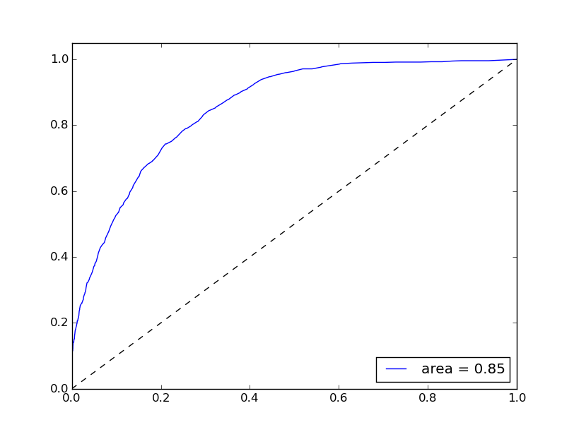

# today-AI-learned
Machine learning reddit's [today-I-learned](http://thoppe.github.io/today-AI-learned/#/) (TIL) subreddit to mine for new and interesting things.

From the [DC Hack and Tell](http://www.meetup.com/DC-Hack-and-Tell/) Round 20: Severe Municipal Jazz, May 11, 2015, [presentation link](http://thoppe.github.io/today-AI-learned/index.html).

## Data collection
  
Supervised machine learning requires a massive tagged collection of high-quality data to be effective. Fortunately the past submissions of to r/TIL have done just that. Redditors have carefully curated a selection of posts that they collectively find interesting through their voting system. We can filter these posts to just those that point to Wikipedia as a source. This way, the source of each post uses a somewhat standardized language and grammar.

##### [src/subreddit_dl.py](src/subreddit_dl.py)

Initally I started with the top 1000 posts of all-time (due to an API restriction in reddit's search) using [praw](https://praw.readthedocs.org/en/). Ultimately however, I extended that to all posts that had a score of > 1000 in the years 2013 and 2014 (resulting in about 5000 quality TIL posts) using an alternate database.

##### [src/wikipedia_dl.py](src/wikipedia_dl.py)

From here it is relatively easy to download a parsed down versed of the wiki page linked to by the reddit post.

## Data wrangling

##### [attribute_TIL.py](attribute_TIL.py)

Somehow, we have to link the pithy one-line TIL title to the correct paragraph in the Wikipedia article. This is a non trivial task, as simple word frequencies are not enough. Ultimately I settled on a sort of "word-entropy". That is, each paragraph was stripped to it's unique words and these sets all formed a frequency vector for each paragraph. These vectors were normalized so that the unique words in each paragraph carried more weight. Then we took the title of the TIL post and compared it to the vectors of each paragraph settling on the paragraph with the closest match. This turns out to work surprisingly well.

Additionally, I saved the non-matching paragraphs as some useful false positives.

##### [build_decoy_db.py](build_decoy_db.py)

The next step was to prep the Wikipedia corpus.
Using a full XML corpus of Wikipedia (not provided and parsed with [`bs4`](http://www.crummy.com/software/BeautifulSoup/bs4/doc/)), I tokenized and stemmed each paragraph of text for each article. This uses both [`nltk`](http://www.nltk.org/) for the word tokenization & stop words and the porter2 stemmer from the aptly named package [`stemming`](https://pypi.python.org/pypi/stemming/1.0).

This creates a rather massive SQLite database with each paragraph and the associated meta-data (like title, paragraph number, word-entropy, ...). Since there are many millions of assorted paragraphs (and I assume very few of them are interesting), I am going to use a random sampling of some of these as True Negatives in my machine learning. 

## Machine Learning

##### [src/build_features.py](src/build_features.py)

Initially, I experimented with a simple word frequency as my feature vector. While this works for toy problems, the corpus of Wikipedia needed a smarter way to condense down the data. Fortuntetly, a neat textual feature generator, Word2Vec (developed by Google) is available in [`gensim`](https://radimrehurek.com/gensim/).

Using Word2Vec requires two complete passes over the data, though it allows you to use an iterator making the memory requirements rather small.

##### [train.py](train.py)

Here, perhaps lies the most contentious part of the project, the construction of the classifier. In the end, I settled for the Extremely Random Trees implementation in [`scikit-learn`](http://scikit-learn.org/stable/modules/generated/sklearn.ensemble.ExtraTreesClassifier.html). This classifier, while fairly poor at detecting new true positives at about 10%, was extremely proficient at marking the true negatives. Since the assumption is that most of Wikipedia is, in fact, quite boring, this will help narrow down the results immensely.

    Training classifer
    Test Accuracy: 0.878
    Test Accuracy on TP: 0.116
    Test Accuracy on TN: 0.998

  

##### [score.py](score.py)

With the classifier solved, the next step is score each and every paragraph in Wikipedia. The classifier marks about 6 per 10000 as potential candidates.

##### [report.py](report.py)

With the positives marked, we need to prepare the potentially interesting things to a human-readable format!
Report starts building a new database that contains only the positive entries and the associated wikipedia text from the original source.

##### [cross_reference.py](cross_reference.py)

Nobody likes a repost (unless it's a better, well-timed one...), so we need to find out what has already been posted to reddit.
To do so, we need a proper search name of the wikipedia article.
The module `mediawiki-utils` can do this, but stupidly requires python3.
Thus the cross-reference program makes a system call to properly encode name as a search query for reddit.
We then take the top search result (if exists) and store it; this info will serve as the criteria for a post/repost.

##### Find the best time to post!

to do...